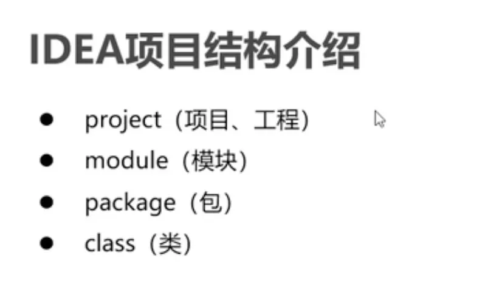
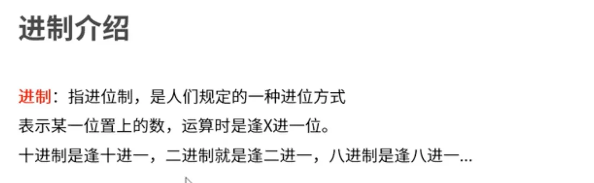
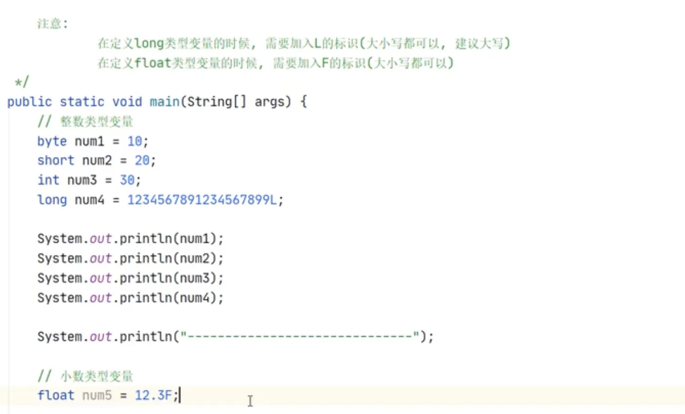
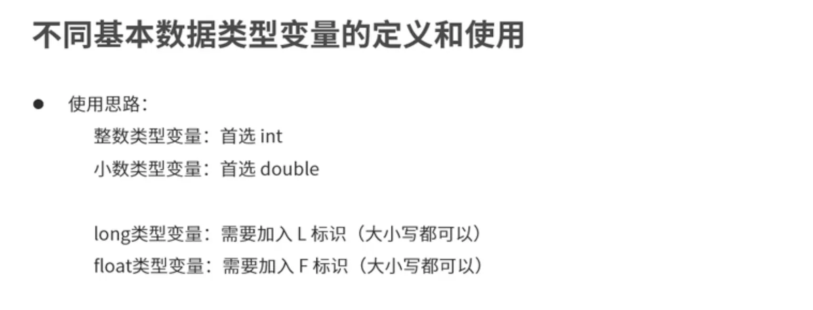
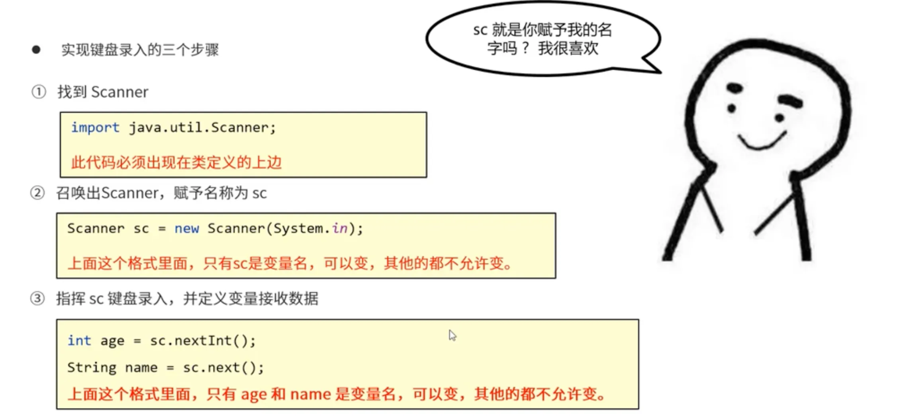
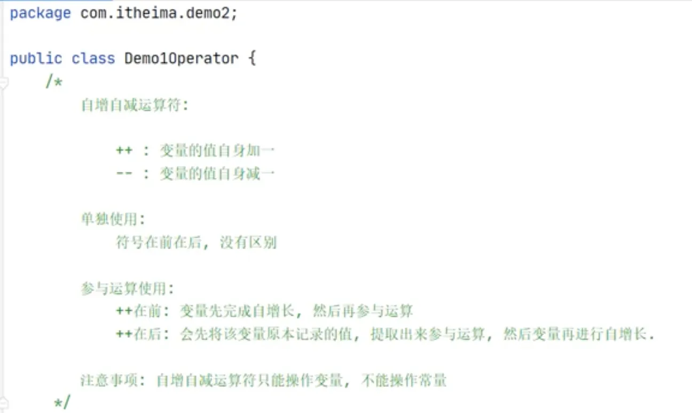
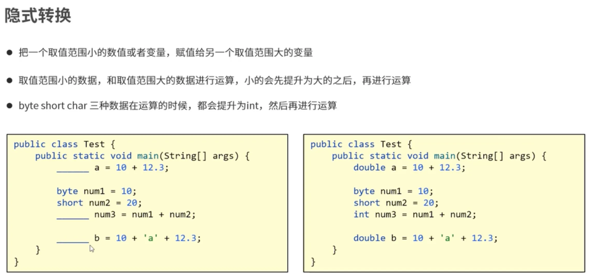
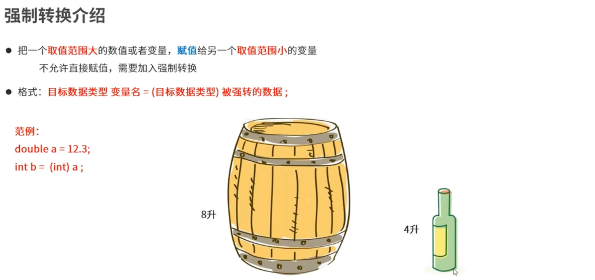

# JAVASE

# 0、准备工作

## 0.1 帮助文档

[Java SE 6 API 开发文档 - JDK API 1.6.0 中文版_jdk api 1.6.0中文版-CSDN博客](https://blog.csdn.net/weixin_52798213/article/details/136418635)

**Java官网 - 在线文档（英文）**
Java SE 8 API ：[https://docs.oracle.com/javase/8/docs/api](https://docs.oracle.com/javase/8/docs/api)
Java SE 7 API ：[https://docs.oracle.com/javase/7/docs/api](https://docs.oracle.com/javase/7/docs/api)
Java SE 6 API ：[https://docs.oracle.com/javase/6/docs/api](https://docs.oracle.com/javase/6/docs/api)
Java SE 5 API ：[https://docs.oracle.com/javase/1.5.0/docs/api](https://docs.oracle.com/javase/1.5.0/docs/api)
**Java开发网 - 在线文档（中文）（致敬前辈）**
JDK 6.0 API 中文手册 - [http://www.cjsdn.net/Doc/JDK60](http://www.cjsdn.net/Doc/JDK60)
JDK 5.0 API 中文手册 - [http://www.cjsdn.net/Doc/JDK50](http://www.cjsdn.net/Doc/JDK50)
**离线文档（.chm格式 - 中文）（推荐珍藏）**
下载：[JDK API 1.6.0 中文版.zip](https://link.csdn.net/?from_id=136418635&target=https%3A%2F%2Fwwz.lanzoue.com%2FiTjp41q7gwwf)
密码：0229

# 1、安装

[一站式通关｜macbookPro安装jdk8并配置环境变量_哔哩哔哩_bilibili](https://www.bilibili.com/video/BV1ag411k7Tk/?spm_id_from=333.337.search-card.all.click&vd_source=7dc981e4bad3ccd339ec66018094fe7c)

[3-5 MacOS JDK22版本卸载_哔哩哔哩_bilibili](https://www.bilibili.com/video/BV1YJemeNE8V/?spm_id_from=333.1007.top_right_bar_window_history.content.click&vd_source=7dc981e4bad3ccd339ec66018094fe7c)

[MAC OSX安装多个版本的JAVA（jdk jre通用）_mac 会覆盖安装jdk吗-CSDN博客](https://blog.csdn.net/fengyong7723131/article/details/52913785)

## 1.1 java环境变量配置

```jsx
1、/usr/libexec/java_home -V (注意V是大写) 
2、touch .bash_profile 新建配置文件 
3、open -e .bash_profile 打开配置文件 
4、vim .bash_profile 编辑配置文件 
5、rm -f ~/.bash_profile 删除配置文件 
6、jdk环境变量模版 
#JAVA 
JAVA_HOME=我的jdk路径 
PATH=$JAVA_HOME/bin:$PATH:. 
CLASSPATH=$JAVA_HOME/lib/tools.jar:$JAVA_HOME/lib/dt.jar:. 
export JAVA_HOME 
export PATH 
export CLASSPATH 
7、source ~/.bash_profile 生效配置文件
```

## 1.2 java版本的管理

```jsx
/*
MAC自带的jdk1.6是苹果公司自己修改的jdk版本，被广泛应用于各种mac软件，具有不可替代性；同时，java1.7和1.8有时也需要用到。因此，在mac上安装、使用多个版本的java具有重要意义。以下以1.6和1.8为例介绍安装、使用方法。

1.从JAVA官网下载jdk1.8或者jre1.8的安装包，点击安装。这一步过后，在命令行输入java -version仍然显示为1.6，因为1.8虽然被安装了，但是并没有配置。

2.把/usr/libexec中的java_home文件删除。该文件记录了原始的java路径，即jdk1.6所处的位置，装完jdk1.8之后会被覆盖，总之就是只能记下一个版本的java，不好用，删之。下面我们自己做。

3.把jdk1.6的home文件夹软连接至usr/libexec文件夹中
*/

sudo ln -s /System/Library/Java/JavaVirtualMachines/1.6.0.jdk/Contents/Home /usr/libexec/java_6_home 
//4.把jdk1.8的home文件夹软连接至usr/libexec文件夹中（注意，区别于jdk1.6在/System/Library中，jdk1.8的默认安装位置在/Library中）

sudo ln -s /Library/Java/JavaVirtualMachines/jdk1.8.0_201.jdk/Contents/Home /usr/libexec/java_8_home
//如果装的不是jdk1.8而是jre1.8，则又不同（为何如此蛋疼的默认安装位置）

sudo ln -s /Library/Internet Plug-Ins/JavaAppletPlugin.plugin/Contents/Home /usr/libexec/java_17_home
//之所以需要做软连接是因为如果java的安装路径中有空格，例如jre1.8的/Library/Internet Plug-Ins/JavaAppletPlugin.plugin/Contents/Home，在下一步做alias命令的时候会导致报错，软连接到没空格的路径之后则不会

//5.打开~/.bash_profile，没有的话创建

vim ~/.bash_profile
//6.在文件中写入，保存、退出

//复制代码
JAVA_6_HOME="/usr/libexec/java_6_home"
export JAVA_6_HOME
JAVA_8_HOME="/usr/libexec/java_8_home"
export JAVA_8_HOME
export JAVA_HOME=$JAVA_6_HOME #开机默认使用1.6
alias jdk6="export JAVA_HOME=$JAVA_6_HOME"#在命令行输入jdk6则转成1.6
alias jdk8="export JAVA_HOME=$JAVA_8_HOME"#输入jdk8则转成1.8

//复制代码
//7.重启。以后要使用jdk1.6的时候则在命令行输入jdk6，要使用jdk1.8的则输入jdk8。简单爆了有没有
```

## 1.3 windows环境安装

[2024.Java安装教程（含常见问题解决）-CSDN博客](https://blog.csdn.net/2301_79705215/article/details/142220108)

# 2、IDEA项目结构介绍

## 2.1 IDEA安装

[https://www.yuque.com/strive-rd6n1/mpd5f0/wzyaxlo2184i244f?singleDoc](https://www.yuque.com/strive-rd6n1/mpd5f0/wzyaxlo2184i244f?singleDoc)



# 3、基础知识

## 3.1 关键字


## 3.2 常量的分类


## 3.3 进制




## 3.4 命名方法


## 3.5 变量类型






☑️定义long类型变量的时候，需要加入L的标志（大小写都行，建议大写字）

☑️定义float类型变量的时候，需要加入F的标志（大小写都可以）

## 3.6 ASCII码表


## 3.7 原码反码补码


1. 计算机中的一个字节由8个二进制位组成
2. 原码的补码和反码相同

计算机内的计算都是通过补码运算的


补码转换成原码，和原码转换为补码一样


**赋值运算符自带强转效果，

## 3.8 逻辑运算符


### 3.8.1 短路逻辑运算符


短路逻辑运算符可以提升一点程序效率

### 3.8.2 三元运算符


## 3.9 运算符优先级


## 3.10 流程控制


### 3.10.1 if语句


### 3.10.2 switch语句


# 4、类C语言操作

## 4.1 输出


## 4.2 键盘录入




## 4.3 四则运算


1+99+“年黑马“ —>运算结果为100年黑马


数值拆分的代码


## 4.4 自增自减运算符


++在前：变量先完成自增涨，然后再参与运算

++在后：变量先记录原本记录的值，提取出来参与运算，然后变量自增长




## 4.5 循环


### 4.5.1 for循环


定义的 i 就像跑圈时，心里默念的数字，跑三圈，每次跑完一圈就会+1，等≤2的时候就会停止，一旦执行条件为false就会停止

```jsx
public class TestFor {
    public static void main(String[] args){
        for(int i = 0; i <= 2; i++ ){
            System.out.println("跑圈");
        }
    }
}
```

```jsx
public class TestFor {
    public static void main(String[] args){
        for(int i = 5; i >=1; i-- ){
            System.out.println(i);
        }
    }
}
```

```jsx
public class TestFor {
    public static void main(String[] args){
        int sum =0;
        for(int i =1; i <= 5; i++){
            sum +=i;
        }
        System.out.println("1到5的总和是"+sum);
    }
}
```


```jsx
public class TestFor {
    public static void main(String[] args){
        int sum =0;
        int a =0;
        int b =0;
        int c =0;
        for(int i =100; i <= 999; i++){
            a = i%10;
            b = i/10%10;
            c = i/100%10;
            if(a*a*a+b*b*b+c*c*c==i){
                System.out.println(i);
            }
        }
    }
}
```

🥸for循环的注意事项

1、循环中定义的变量，在每一轮循环结束后，都会从内存中删除

2、for循环中()和{}之间的分号

3、手动制造无限循环（无限循环下面不能写代码，因为执行不到）

```java
 //2、for循环中()和{}之间的分号
 for(i=1;i<=10;i++);{
	  System.out.println(“HELLO WORLD”);
 }
 /*这一句只会打印出一个HELLO WORLD,因为for()后面的分号已经结束了循环，相当于只定义了一个
 没有循环体的循环*/
 
 //3、手动制造无限循环
 for(;;){
 }
```

😯注意


### 4.5.2 while循环


### 4.5.3 do-while循环


三种循环的区别


### 4.5.4 break和continue

💬1、break当满足条件的时候，跳出当前循环，countinue满足条件时，跳过当前那一步循环

2、break和continue都只能跳出所在那一层循环

3、如果要跳到指定的那一层，可以用标号，具体代码如下


# 5、Java入门知识

## 5.1 隐式转换




1、把一个数值范围小的数值或者变量，赋值给另一个取值范围大的变量

2、取值范围小的数据和取值范围大的数据进行运算，小的会提升为大的之后，再进行运算

3、byte short char 三种数据在运算的时候，都会提升为int，然后再进行运算

## 5.2 强制转换



^，异反运算符，两个不相等的元素为true，相等为false

创建程序窗体


## 5.3 对象创建和类定义


在创建类文件的时候，不赋值变量

打印Sout（stu），出现以下返回值，@后面是16进制数，表示stu的存储位置


❓（理解点）引用数据类型的默认值也是：null

引用数据类型的理解，stu是创建的一个变量，他的类型Student就是一个引用数据类型

## 5.4 成员方法


关于成员方法的调试


1.主方法最先调用，由虚拟机使用，存放在栈内存；

2.当new代码运行的时候，会在堆内存中创建一个对象，里面的name和age是默认值，地址是0x0011（举例）；

3.当打印的时候，sout拿0x0011找到堆内存的成员变量并打印。


return下面不能编写代码，因为return还有一个作用是结束这个方法，方法会直接弹栈

## 5.5 This关键字


方法中调用成员变量，遵循就近原则，这里打印出来的是“西域狂鸭”，也就是方法中形参的赋值


但是如果在sout中加上this，就可以打印出成员变量


## 5.6 方法重载


方法重载：同一个类，有同名的多个成员方法，但是方法之间的参数类型和个数不同==注意，与返回值没有关系！


方法重载是指的参数的不同，以上属于方法的重复定义，编译会出错


仅仅只是参数顺序不同的方法重载，没有意义


## 5.7 构造方法


## 5.8 JavaBean类的构建（封装概念的应用）


对象作为参数进行传递


## 5.9 方法作为对象的返回（定义创建对象的方法）


首先定义Student的Javabean类


然后写StudentTool的类


最后写程序测试StudentTool方法


## 5.10 数组


数组是用来存储同类数据类型的容器

### 5.10.1 数组的定义


```java
//原格式
//数据类型[]数据名 = new 数据类型[]{}
int[] arry = new int[]{1,2,3};
```

💬打印数组名会打印出数组在内存中的地址值

### 5.10.2 数组元素的更改


### 5.10.3 数组元素的遍历


### 5.10.3 数组动态初始化


### 5.10.4 数组内存展示


💬1、在调用数组方法的时候，先在栈内存中引入数组方法；

💬2、new了数组对象之后，在堆内存开辟空间，并把地址值交给栈内存的arr变量储存


两个数组arr在栈内存中记录的是同一个地址值，如果更改堆内存中的数组元素，两个数组arr输出的结果都会发生改变

### 5.10.5 案例数组反转


想像start和end分别代表两个指针，start++和end—代表指针分别向右和向左移动，当移动至重合的时候，停止循环

## 5.11 二维数组


二维数组的使用场景

### 5.11.1 二维数组的静态初始化


```java
//例子
int[][] arr1 = new int[][]{{11,22,33},{22,33,44},{33,44,55}};
int[][] arr2 = new {{1,2,3},{2,3,4},{3,4,5}};
/*
效果，定义出一个
123
234
345
的二维数组
*/
```

二维数组的访问

```java
system.out.println(arr1[1][2]);
```

💬如果对二维数组采用arr1[1]来访问，得到的是一个地址值，说明二维数组是一个装了很多一维数组地址值的容器

### 5.11.2 二维数组的遍历


```java
        for (int i = 0; i < arr.length; i++) {
            for (int j = 0; j < arr[i].length; j++) {
                System.out.println(arr[i][j]);
            }
```

💬二维数组的遍历有快捷键，

arr.fori  然后 arr[i].fori

### 5.11.3 二维数组的动态初始化


## 5.11 集合

### 5.11.1 列表List

[Java关于ArrayList的简单用法与介绍_哔哩哔哩_bilibili](https://www.bilibili.com/video/BV1CC4y177CW/?buvid=XYE5E4DEA78210D095FE181D0D1ED86B9A40A&from_spmid=search.search-result.0.0&is_story_h5=false&mid=dLJhbYysePMpkeMHEj1k6g%3D%3D&p=1&plat_id=116&share_from=ugc&share_medium=android&share_plat=android&share_session_id=1785396d-0a43-47cb-8b29-aedb08c40767&share_source=WEIXIN&share_tag=s_i&spmid=united.player-video-detail.0.0&timestamp=1731584526&unique_k=jukbHkP&up_id=470489314)

```java

import java.util.ArrayList;
import java.util.List;
 
public class test_demo {
    public static void main(String[] args) {
 
        // 1. 直接添加
        List<String> list = new ArrayList<>();
        list.add("test01");
        list.add("test02");
        list.add("test03");
 
        // 2. 添加到指定位置、
        list.add(2,"www");
        for(String stu:list){
            System.out.print(stu+" ");
        }
    }
```


### 5.11.2 Set集合


### 5.11.3 Map集合


[JAVA第40讲集合体系（List、Set、Map）_哔哩哔哩_bilibili](https://www.bilibili.com/video/BV1134y167kq/?buvid=XYE5E4DEA78210D095FE181D0D1ED86B9A40A&from_spmid=search.search-result.0.0&is_story_h5=false&mid=dLJhbYysePMpkeMHEj1k6g%3D%3D&plat_id=116&share_from=ugc&share_medium=android&share_plat=android&share_session_id=eea45830-3731-4a15-a9a9-cf3d7b83dffd&share_source=WEIXIN&share_tag=s_i&spmid=united.player-video-detail.0.0&timestamp=1732106738&unique_k=raTJCq0&up_id=491258554&vd_source=7dc981e4bad3ccd339ec66018094fe7c)

# 6、JAVA高级知识

## 6.1 继承

### 6.1.1 什么是继承

继承：让类与类之间产生关系（子父类关系），子类可以直接使用父类中非私有的成员


💬重点：一个JAVA文件中可以编写多个class，但是只能有一个类被public所修饰

```java
package com.baidu;

public class TestExtend {
    class Fu{

    }
    class Zi extends Fu{

    }
}
```

💬但是java中的对象一般被封装了，变量一般是私有的，意味着子类无法直接继承父类中的私有变量，但是如果父类是JAVABEAN类的封装的话，可以通过继承父类的SET和GET方法来访问父类的私有变量。


### 6.1.2 继承的好处和弊端

继承的好处

1、提高了代码的复用性

2、提高了代码的维护性

3、让类与类之间产生了关系，是多态的前提

继承的弊端

1、提高了代码的耦合度

### 6.1.3 单继承，多继承，多层继承


1、单继承：单层继承，一个子类继承一个父类

2、多继承：一个子类继承多个父类

3、多层继承：子类继承父类，父类继承它的父类

### 6.1.4 继承中成员变量的特点


### 6.1.5 继承中成员方法的特点


子类中出现父类同名的方法，优先使用的是子类中定义的方法

但这实际上是对父类方法的重写

### 6.1.6 方法重写


💬方法重写的应用场景，当子类需要父类的功能，但是功能主体子类有自己的特有内容，可以重写父类中的方法，这样，即沿袭了父类的功能，又定义了子类特有的功能

💬@Override 属于注解，加上注解之后会自动检查是否属于注解的类型，例如方法注解要求继承的方法同名同参数，如果不同名同参数，就会报错。


### 6.1.7 继承的构造方式介绍

**子类中所有的方法默认都会访问父类中无参的构造方法**

1. 子类在初始化的时候，有可能会使用到父类中的数据，如果父类没有完成初始化，子类将无法使用父类的数据。
2. 子类初始化之前，一定要先完成父类的初始化
3. 构造方法的第一条语句默认都是：super（）
4. 注意：如果我们编写的类，没有手动置顶父类，系统会自动继承Object（Java继承体系中的最顶层父类）


子类中调用父类的成员方法，如果子类没有对父类方法进行重写

super关键字可以省略不写

## 6.2 Final关键字


💬常量的命名规范：

1. 如果是一个单词，所有字母大写，
2. 如果是多个单词，所有字母大写，但是中间需要使用_进行分隔

```java
final int a = 10;

final int MAX =20;

final int MAX_VALUE = 30;
```

💬final修饰方法，地址值不能更改

💬final修饰成员变量时，初始化时机：

1. 在创建时，直接给值；
2. 在构造方法结束之前，完成赋值；

```java
public class Final{
	final int a = 10;
	public Final(){
		int a =10;
	} 
}
```


💬final修饰类，该类不能拥有子类

💬final修饰成员方法，成员方法不能重写


## 6.3 抽象类


💬抽象类：从理解层面来说，就是把相似的部分抽取到一个父类中（共性行为向上抽取）

当行为抽取到父类之后，发现**这个行为在父类中描述不清了**

**且该行为还是子类必须要做的事情（子类不做会报错）**，就将其定义为抽象方法

抽象方法需要存活在抽象类当中（abstract）

简单记：抽象类就是一个特殊的父类，该父类中可以定义抽象方法


## 6.4 接口

### 6.4.1 接口介绍

💬接口：体现的思想是对规则的声明

JAVA中的接口更多的是体现对行为的抽象


### 6.4.2 接口的创建


### 6.4.3 接口的成员特点


### 6.4.4 类与接口的关系


💬接口与接口之间，接口可以继承多个接口，但其实现类需要重写所继承接口的成员方法

## 6.5 多态

### 6.5.1 多态概述


### 6.5.2 多态成员的访问


```java
package com.baidu;

public class TestInterface {
    public static void main(String[] args) {
        Fu fu = new Zi();
        //成员变量，编译看左边，执行看左边
        //以下代码输出：10
        System.out.println(fu.num);
        //成员方法，编译看左边，执行看右边
        //以下代码输出：我是ZI类的成员方法
        fu.method();
    }
}

class Fu {
    int num = 10;
    public void method(){
        System.out.println("我是FU类的成员方法");
    }
}
class Zi extends Fu{
    int num = 20;
    @Override
    public void method() {
        System.out.println("我是ZI类的成员方法");
    }
}
```

### 6.5.3 多态的好处和弊端


### 6.5.4 多态的转型


```java
package com.baidu;

public class InstanceOf {
    public static void main(String[] args) {
        InstanceOf d = new InstanceOf();
        d.useAnimal(new dog());
    }
    public void useAnimal(animal a){
        a.eat();
        if(a instanceof dog){
            dog d = (dog) a;
            d.watchDoor();
        }else if(a instanceof cat){
            cat d = (cat) a;
            d.Mouse();
        }
    }
}

class animal{
    public void eat(){
        System.out.println("吃饭");
    }
}
class dog extends animal{
    @Override
    public void eat() {
        System.out.println("狗吃肉");
    }
    public void watchDoor(){
        System.out.println("狗看家");
    }
}
class cat extends animal{
    @Override
    public void eat() {
        System.out.println("猫吃鱼");
    }
    public void Mouse(){
        System.out.println("猫捉老鼠");
    }
}

```

## 6.6 事件


## 6.6 静态关键字


## 6.7 正则表达式

离线版

[百度网盘 请输入提取码](https://pan.baidu.com/s/1L2Z82mqbdVoaFvKO7C7I5A?pwd=kqge)

[Road 2 Coding](https://r2coding.com/#/README?id=正则表达式)

[耗时一周，我打造了一个正则表达式学习神器！_哔哩哔哩_bilibili](https://www.bilibili.com/video/BV1Nt4y1a7YQ/?spm_id_from=333.337.search-card.all.click&vd_source=7dc981e4bad3ccd339ec66018094fe7c)


## 6.8 Stream流

Stream是在Java8中提出的概念，在低于Java8的版本中不能使用

- Stream处理list对象
    
    1、源头：原数据（集合、数组）转化为Stream流对象
    
    2、管道（波）：对Stream流对象中的元素进行一系列的过滤、排序、分组等操作，并返回一个Stream流对象
    
    3、终点：按照需求，对Stream流进行遍历、收集、统计等操作
    

# 10、2048实现过程（一般软件设计过程）


## 10.1 窗体绘制


## 10.2 按钮的设置


```jsx
//两个点表示链式编程
st.getStudent().getName()
//因为在st.getStudent()这个成员方法中返回的是一个对象，所以用getName继续调用对象的成员方法
getContentPane().add()
```


```jsx
//窗体结构和组件创建
//取消窗体的默认布局
窗体对象.sayLayout(null);
//加入组件
窗体对象.getContentPane().add(组件)
```

```jsx
//具体代码
				//1.通过窗体对象，取消默认布局
        frame.setLayout(null);
        //2.创建对象按钮
        JButton btn = new JButton();
        btn.setBounds(50, 50, 100, 100);
        JButton btn2 = new JButton("点我啊～");
        btn2.setBounds(150, 150, 200, 200);

        //3.通过窗体对象，获取面板对象，并调用add方法添加组建
        frame.getContentPane().add(btn);
        frame.getContentPane().add(btn2);
        
```